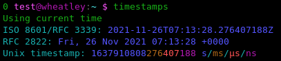

# *Too many Timestamps*

Simple command line tool to interpret and convert UNIX timestamps

## Usage

### Current time

The actual command is called `timestamps`.
When run with no arguments, it prints info for the current time



### Timestamp decoding

To decode a timestamp, simply provide it as argument
```
$ timestamps 1637906683
```

You can optionally decode other formats by providing the corresponding option
```
-S, --seconds         Interpret input as seconds (the default)
-M, --milliseconds    Interpret input as milliseconds
-U, --microseconds    Interpret input as microseconds
-N, --nanoseconds     Interpret input as nanoseconds
```

### Snowflake ID decoding

This tool also supports decoding Discord and Twitter IDs ("Snowflake" format) using these options
```
-D, --discord         Interpret input as a Discord ID
-T, --twitter         Interpret input as a Twitter Snowflake
```
> The non-time info available in Snowflakes is specific to the platform that generated it.


## Building and installing

To build this tool, you should not need anything more than an up to date Rust toolchain and running `cargo build` in the repository.

> I have no way to test this, but it seems that compatibility should be complete for all non-embedded platforms that rust supports.

To install, copy the binary wherever you want on the system, and optionally install the completions for your shell.


## Copyright

Copyright (C) 2021 0x5c

This program is released under the terms of the *Québec Free and Open-Source Licence – Strong Reciprocity (LiLiQ-R+)*, version 1.1.  
See [`LICENCE`](LICENCE) for full license text (Français / English).
